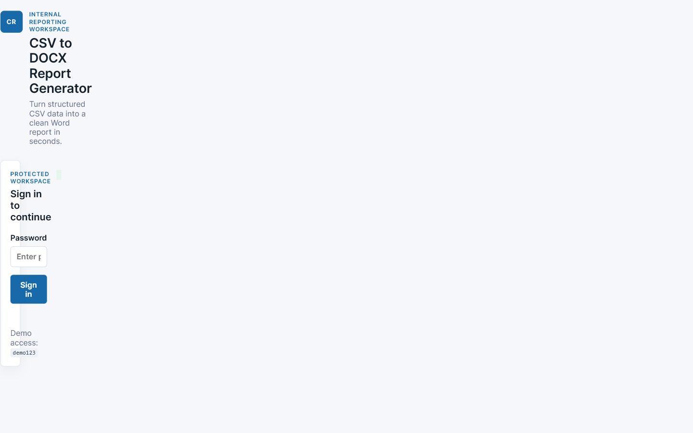
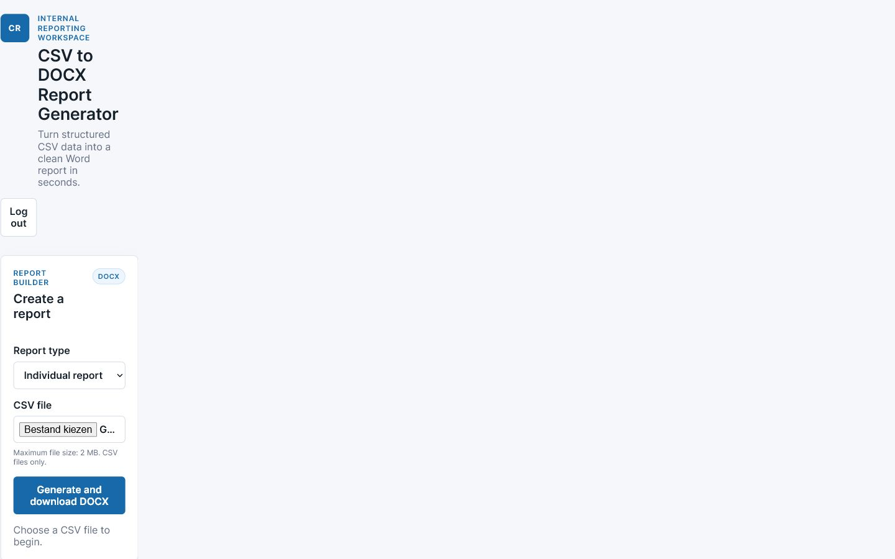

# CSV to DOCX Report Generator

A small Node.js web app that turns CSV uploads into downloadable Word reports with login, report type selection and activity logs.

## Why this is useful

Teams often have working scripts but no simple interface for non-technical users. This project demonstrates how a CSV-to-report workflow can be wrapped in a small internal tool with a clear upload flow, basic access control and an auditable activity log.

## Features

- Password-protected internal workspace
- CSV upload with file type and size validation
- Individual and team report modes
- Downloadable `.docx` output
- Simple activity log with timestamp, filename, report type and row count
- Sample CSV for a quick demo
- Responsive browser interface
- Basic security headers and safe log rendering
- Automated tests for CSV parsing and DOCX generation

## Screenshots

Add screenshots to `docs/screenshots/` using the capture list in [PORTFOLIO.md](PORTFOLIO.md):

- Login screen
- Upload and report builder
- Individual/team selection
- Download confirmation
- Activity log
- README/GitHub page
- Project folder or terminal showing `npm start`

Current demo captures:





## Demo access

The default local demo password is:

```text
demo123
```

Set `DEMO_PASSWORD` before starting the server to use another password.

## Installation

Requirements: Node.js 18 or newer.

```powershell
npm install
npm test
npm start
```

Open [http://localhost:4175](http://localhost:4175) in a browser.

## Usage

1. Sign in with the demo password.
2. Choose `Individual report` or `Team report`.
3. Select `samples/sample-report-data.csv`, or upload another CSV.
4. Select `Generate and download DOCX`.
5. Open the downloaded Word file and review the activity log.

The CSV should contain a header row followed by one or more data rows. The generator previews the first six columns and the first twenty data rows in the document.

## Example workflow

```text
CSV upload -> CSV parsing -> report type selection -> DOCX generation -> download -> activity log entry
```

The report-generation boundary is intentionally small so the demo can later call existing Node.js scripts, Python scripts or branded Word templates.

## Technology

- Node.js and Express
- Multer for in-memory file uploads
- `docx` for Word document generation
- Vanilla HTML, CSS and JavaScript
- Node's built-in test runner

## Project structure

```text
.
|-- data/activity-log.json       Runtime activity log
|-- lib/reportGenerator.js       CSV parser and DOCX generator
|-- public/index.html             Browser markup
|-- public/app.js                 Browser interactions
|-- public/styles.css             Responsive UI styles
|-- samples/sample-report-data.csv Demo input file
|-- test/reportGenerator.test.js  Unit tests
|-- server.js                     Express server and API routes
|-- PORTFOLIO.md                  Portfolio and outreach copy
|-- package.json                  Scripts and dependencies
`-- .env.example                  Optional environment settings
```

## API routes

- `GET /api/health` returns a lightweight service health response.
- `GET /api/status` reports whether the current browser session is logged in.
- `POST /api/login` creates an in-memory session.
- `POST /api/logout` clears the current session.
- `GET /api/logs` returns the latest activity entries for a logged-in user.
- `POST /api/report` accepts a `csv` file and `reportType`, then returns a DOCX file.

## Deployment

This MVP can run on Render, Railway or Fly.io:

1. Push the repository to GitHub.
2. Create a Node web service from the repository.
3. Use `npm install` as the build step and `npm start` as the start command.
4. Set `DEMO_PASSWORD` to a private value.
5. Use the platform-provided `PORT` environment variable.

For production, replace the in-memory sessions and JSON activity log with a persistent database, add a real user system, use HTTPS and store uploads outside the process memory.

## Future improvements

- Connect the generator to the client's existing scripts
- Add branded Word templates and editable report copy
- Add charts and summary metrics to DOCX output
- Add role-based users and persistent storage
- Add CSV column mapping and validation rules
- Add deployment configuration and monitoring
- Add end-to-end browser tests

## Client-ready explanation

This is a compact proof of concept for turning an existing CSV/report script into an internal web workflow. It gives a user a protected upload page, two report modes, a direct Word download and a simple audit trail. The same structure can be adapted to existing scripts, templates and deployment preferences.

## Portfolio positioning

Use the ready-to-copy English and Dutch project descriptions in [PORTFOLIO.md](PORTFOLIO.md).

## Disclaimer

This repository is a demo/MVP for portfolio and client discovery. The default password, in-memory sessions and JSON log are intentionally simple and should be replaced before handling sensitive production data.

